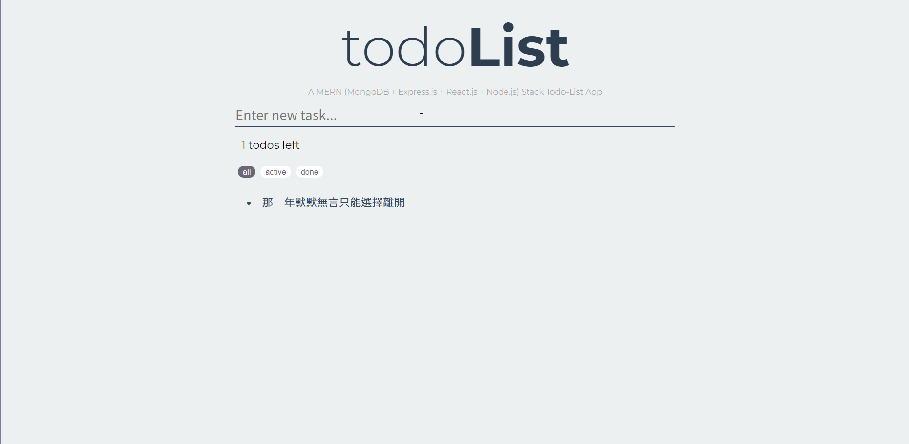

<div align="right">
  
  <a href="https://github.com/Hsins/udemy_MERN-Todo-List/blob/master/LICENSE" alt="License">
    
  </a>
</div>


# Demo

<div align="center">
  
</div>

You can see a complete working example [here](https://hsins-mern-todolist.herokuapp.com/). Or you can run the demo on your local machine, please follow the instructions in [Getting Started](#getting-started).

# Features

- A MERN (MongoDB + Express.js + React.js + Node.js) full stack project.
- Refactored with ES6 and ES7 syntax (eg: async/await)
- RESTful API:

```
-------------------------------------------------------------------------
Todos Route
-------------------------------------------------------------------------
[Method]  [Route]
GET       /api/todos              Fetch all todos
POST      /api/todos              Create a new todo
GET       /api/todos/:id          Fetch a todo status
POST      /api/todos/:id          Toggle (complete or not) a task
PATCH     /api/todos/:id          Update the todo content
DELETE    /api/todos/:id          Delete todo
```

# Technologies

## Frontend

- [axios](https://github.com/axios/axios)
- [http-proxy-middleware](https://github.com/chimurai/http-proxy-middleware)
- [React](https://reactjs.org/)
- [Redux](https://redux.js.org/)
- [Redux-Thunk](https://github.com/reduxjs/redux-thunk)

## Backend

- [nodejs](https://nodejs.org/en/)
- [express](https://gulpjs.com/)
- [mongodb](https://webpack.js.org/concepts/)

Check [`package.json`](https://github.com/Hsins/udemy_MERN-Todo-List/blob/master/package.json) file for more information.

# Getting Started

Follow the instructions below to set up the environment and run this project on your local machine. Note that you should setup your MongoDB Atlas Cluster first to get your database. You can find the [Quick Note](https://hackmd.io/@Hsins/r1oFNI864) here.

1. Clone this repository.

```bash
# Clone repository
$ git clone https://github.com/Hsins/udemy_MERN-Todo-List.git
```

2. Install dependencies via NPM or Yarn

```bash
# Install dependencies via npm
$ npm install
$ cd client
$ npm install
$ cd ..

# Install dependencies via yarn
$ yarn install
$ cd client
$ yarn install
$ cd ..
```

3. Run the server.

```bash
# Run server
$ npm run dev
```


